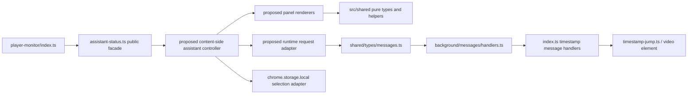

# 当前视频页内助手状态模块拆分方案

## 范围与结论

本文是 GitHub #214 的**仅文档**拆分方案，针对
`src/content/player-monitor/assistant-status.ts`。基线版本中该文件为 5,511
行，当前只有一个对外入口：
`renderCurrentVideoAssistant(context: CurrentVideoContextResult): void`。

本方案不改动运行时代码，不重命名消息，不迁移本地数据，不改变 DOM 选择器，
也不把当前未挂载的功能变成可见功能。后续实现应逐阶段提交、逐阶段回归；每一
阶段都必须保留当前视频证据、真实时间戳、来源/版本/会话隔离、失败如实呈现、
隐私、显式 AI 触发，以及“预览 -> 确认 -> 返回”的动作边界。

### 现状入口和相邻边界

| 位置 | 确切符号 | 当前职责 |
| --- | --- | --- |
| `src/content/player-monitor/assistant-status.ts` | `renderCurrentVideoAssistant` | 注入样式、初始化来源选择监听、更新单例状态并全量重绘页内助手。 |
| `src/content/player-monitor/index.ts` | `initializeMonitorForSnapshot`, `collectAndPublishCurrentVideoContext` | 收集当前页面上下文后调用入口；内容脚本本身持有播放器、导航 epoch 和最终的时间戳跳转/返回执行。 |
| `src/shared/types/messages.ts` | `RequestAction`, `BiliVizResponse` | 页内助手到 Service Worker 的稳定消息协议。 |
| `src/background/messages/handlers.ts` | `handleRequest` 中的 current-video `case` 分支 | 对活跃标签重新解析上下文，重新授权主要文本来源，并持有摘要缓存、问答会话、取消和跳转授权。 |
| `src/content/player-monitor/timestamp-jump.ts` | `performConfirmedTimestampJump`, `performTimestampReturn` | 真正改变播放器时间的唯一内容脚本路径；不应被页内 UI 绕过。 |

## 当前职责和状态归属

### `assistant-status.ts` 当前承担的责任

| 区域 | 现有符号 | 责任和事实来源 |
| --- | --- | --- |
| 容器和可访问性 | `CARD_ID`, `STYLE_ID`, `CSS`, `renderAssistantShell`, `renderCollapsedCard`, `renderExpandedPanel`, `appendAssistantTabs` | 创建唯一的 `#bdc-current-video-assistant` 容器、四个页签和 ARIA 关系。DOM 是渲染结果，不是证据或会话的权威来源。 |
| 上下文失效 | `updateAssistantContext`, `contextStateKey`, `currentAssistantVideoIdentity` | 在 BVID、CID、分 P、已选来源和证据身份/版本变化时清空或作废页内派生状态。 |
| 主要文本来源选择 | `buildPrimaryTextStateForContext`, `selectPrimaryTextSourceForAssistant`, `ensurePrimaryTextSelectionsLoaded`, `ensurePrimaryTextSelectionStorageListener`, `currentPrimaryTextRequestParams` | 读取/监听 `chrome.storage.local` 的 `currentVideoPrimaryTextSelections`，要求多个可用来源时由用户明确选择，并把授权参数带给后续请求。 |
| 摘要和亮点 | `restoreCurrentVideoSummaryHighlightsFromPage`, `generateCurrentVideoSummaryHighlightsFromPage`, `cancelCurrentVideoSummaryHighlightsFromPage`, `summaryHighlightJumpPreview` | 只在点击“生成摘要与亮点/重新生成”时请求完整主要文本；展示本地缓存、保留此前可用结果，并为亮点提供确认跳转。 |
| 当前视频完整文本问答 | `appendSegmentSearch`, `askCurrentVideoFullTextFromPage`, `loadCurrentVideoQaSessionsFromPage`, `cancelCurrentVideoFullTextQaFromPage`, `appendFullTextQaResult` | 当前可见“问答”页签；按 `sessionId/requestId/turnId` 提交、取消、读取、重命名和删除本地会话，并从持久化的证据快照渲染回答和引用。 |
| 字幕阅读 | `ensureSubtitleViewLoaded`, `runSubtitleSearch`, `reduceCurrentVideoSubtitleFollowState`, `exportSubtitleSource`, `confirmCurrentVideoSubtitleJumpFromPage` | 显示 B站字幕/本地转录、搜索、跟随播放、导出，并对每一行执行独立的预览/确认/返回流程。 |
| 可见文本安全 | `safeVisibleText`, `timestampJumpStatusText`, 各 status/notice formatter | 在向 DOM 写入背景错误、证据说明或模型返回内容前隐藏原始字段、链接、视频编号、接口路径和工程术语。 |
| 已定义但当前未挂载的叶子 | `appendSegmentRetrievalResult`, `searchCurrentVideoSegmentsFromPage`, `appendRelatedFavorites`, `appendVideoKnowledge` | 文件内仍保留本地片段检索、相关收藏和知识节点 UI/请求逻辑；当前没有对这些 `append*` 函数的调用点。拆分不能顺便挂载它们。 |

### 页内单例状态

`AssistantState` 和 `assistantState` 位于同一文件。它混合了 UI、请求生命周期和
临时预览状态；拆分时必须仍只创建**一个**内容脚本控制器实例，不能让每个面板各自
维护另一个当前视频身份或时间戳返回状态。

| 状态组 | `AssistantState` 字段 | 当前所有者 | 作废键/并发保护 |
| --- | --- | --- | --- |
| 壳层 | `expanded`, `activeTab`, `context`, `contextKey` | 页内控制器 | `contextStateKey`。 |
| 摘要/亮点 | `summary*`, `summaryHighlight*` | 页内控制器；缓存权威值在后台 | `summaryRequestId`、`InPageSummaryHighlightsRequest.contextKey`、`selectionRevision`、已选来源身份。 |
| 完整文本问答 | `fullTextQaActiveRequests`, `fullTextQaErrors`, `fullTextQaSessions*`, `fullTextQa*Jump*` | 页内控制器保存显示状态；后台持久化会话 | 每会话 `sessionId`，每轮 `requestId`/`turnId`，以及 `fullTextQaBindingsEqual`。 |
| 字幕 | `subtitleView*`, `subtitleViewingSourceIdentityKey`, `subtitleSearch*`, `subtitleFollow`, `subtitle*Jump*` | 页内控制器；正文行和来源由后台返回 | `currentVideoSubtitleContextKey`、`subtitleViewRequestId`、`subtitleTimestampRequestId`、行的 `lineBindingKey`。 |
| 本地片段检索 | `segment*` | 页内控制器；候选证据由后台计算 | `segmentRequestId` 和 `SegmentTimestampOperationSnapshot`（上下文键和选择 revision）。当前为未挂载叶子。 |
| 相关收藏/知识节点 | `relatedFavorites*`, `knowledge*` | 页内控制器；后台返回的只读结果 | `relatedFavoritesContextKey` / `knowledgeContextKey`。当前为未挂载叶子。 |

除 `assistantState` 外，本文件还拥有一个来源选择缓存：`primaryTextSelections`、
`primaryTextSelectionsLoaded`、`primaryTextSelectionsReadFailed`、各 request/revision
计数器和 `primaryTextSelectionSaveFailedPartKeys`。持久化表的权威副本在
`chrome.storage.local`；保存的权威校验在
`src/shared/current-video-primary-text-selection.ts: resolveCurrentVideoPrimaryTextAuthorization`
和后台的 `SAVE_CURRENT_VIDEO_PRIMARY_TEXT_SELECTION` handler。`USER_CONFIG_STORAGE_KEY`
只被监听以取消活跃的摘要/完整文本问答，不能被面板缓存成一份新的 AI 配置。

### 不属于此模块的状态

| 所有者 | 状态 | 拆分约束 |
| --- | --- | --- |
| `src/content/player-monitor/index.ts` | `latestContext`、`navigationEpoch`、播放器元素、`currentVideoTimestampReturnPoint` | 页内助手只发送已确认的请求；不得直接调用 `<video>.currentTime`，也不得在面板模块复制返回点。 |
| `src/background/messages/handlers.ts` 及其依赖 | 当前标签重新解析、主要文本授权、完整正文、摘要缓存、QA 持久化、取消注册表、时间戳 operation lease | 页内模块不得把本地 `assistantState.context` 当作后台权威值，不得替换后台二次核验。 |
| `src/shared/current-video-primary-text.ts` | `CurrentVideoTextSourceIdentity` 和全文 request envelope | 身份包含 BVID/CID/分 P、来源、语言、正文 hash、时间线 hash 和 `sourceIdentityKey`；UI 只能传递/比较它，不能自行简化。 |
| `src/shared/current-video-subtitle-view.ts` | 纯字幕搜索、来源选择、跟随状态规约、导出格式和行级预览 | 保持为无 DOM/无 runtime 消息的共享逻辑。 |

## 依赖方向

允许的方向是“页内 UI -> 共享纯逻辑/消息适配器 -> 后台”。面板不得 import
`src/background/*`，不得读取数据库、Cookie、浏览器 profile、登录态或本地 key 文件，
不得向 `index.ts` 反向注入播放器操作。目标目录中的共享 state/DOM 工具也不得把
`RequestAction` 字符串散落到每个面板。

## 必须保持的公开、消息和 DOM 合同

### 公开入口

1. 保持 `src/content/player-monitor/assistant-status.ts` 导出的
   `renderCurrentVideoAssistant(context)` 名称、参数和同步返回值。
2. 保持 `src/content/player-monitor/index.ts` 的三处调用语义：初始监控、显式上下文采集和
   待定上下文渲染均可安全重复调用。
3. 新模块只能由该 facade 组装。迁移期间不能同时启动旧控制器和新控制器，否则会造成
   双重 storage listener、重复请求或两个返回点。

### runtime 消息

`sendRuntimeRequest` 必须继续只接受 `RequestAction` 并将 `{ action, params }` 发送给
`chrome.runtime.sendMessage`，只在 `BiliVizResponse.success === true` 且有 `data` 时提交
UI 状态。下表是页内模块当前使用的消息，名称、参数含义和返回类型均为兼容合同。

| 功能 | 动作 | 参数/返回类型 | 保留点 |
| --- | --- | --- | --- |
| 上下文和字幕刷新 | `GET_CURRENT_VIDEO_CONTEXT`, `GET_CURRENT_VIDEO_TRANSCRIPT_EVIDENCE` | `CurrentVideoContextResult`, `CurrentVideoTranscriptEvidenceState` | 刷新前后均用 BVID/CID/分 P 的 `CurrentAssistantVideoIdentity` 核对。 |
| 主要来源 | `SAVE_CURRENT_VIDEO_PRIMARY_TEXT_SELECTION` | `bvid`, `cid`, `page`, `selectedSourceIdentityKey`; `SaveCurrentVideoPrimaryTextSelectionResult` | 保存后读回完整 selections；失败恢复内存选择并阻断提交。 |
| 摘要/亮点 | `GET_CURRENT_VIDEO_SUMMARY_HIGHLIGHTS_CACHE`, `GENERATE_CURRENT_VIDEO_SUMMARY_HIGHLIGHTS`, `CANCEL_CURRENT_VIDEO_SUMMARY_HIGHLIGHTS` | `CurrentVideoSummaryHighlightsResult` | 仅显式生成会上传当前分 P 完整主要文本；读取缓存、重开面板或切换页签不发送。 |
| 完整文本问答/会话 | `ASK_CURRENT_VIDEO_FULL_TEXT`, `CANCEL_CURRENT_VIDEO_FULL_TEXT_QA`, `GET_CURRENT_VIDEO_QA_SESSIONS`, `RENAME_CURRENT_VIDEO_QA_SESSION`, `DELETE_CURRENT_VIDEO_QA_SESSION` | `CurrentVideoFullTextQaResult`, `CurrentVideoQaSessionsView` | 保持 `sessionId/requestId/turnId`、问题保留、会话独立和持久化快照。 |
| 本地片段和辅助结果 | `SEARCH_CURRENT_VIDEO_SEGMENTS`, `GET_VIDEO_KNOWLEDGE`, `GET_CURRENT_VIDEO_RELATED_FAVORITES` | 检索/知识/收藏结果类型 | 目前未挂载；提取后仍不得改变为自动请求或可见入口。 |
| 跳转 | `REQUEST_CURRENT_VIDEO_SEGMENT_JUMP`, `REQUEST_CURRENT_VIDEO_HIGHLIGHT_JUMP`, `REQUEST_CURRENT_VIDEO_QA_CITATION_JUMP`, `REQUEST_CURRENT_VIDEO_SUBTITLE_JUMP`, `RETURN_CURRENT_VIDEO_SEGMENT_JUMP`, `RETURN_CURRENT_VIDEO_SUBTITLE_JUMP` | `CurrentVideoTimestampJumpResponse`, `CurrentVideoTimestampReturnResponse` | 只能在预览后传递 `confirmed: true`；后台签发并消费一次性 lease，内容脚本再执行。 |
| 字幕查看 | `GET_CURRENT_VIDEO_SUBTITLE_VIEW_SOURCES` | `CurrentVideoSubtitleViewSourcesResult` | 与主要文本选择分开；切换字幕查看来源不能隐式改变主要文本来源。 |

所有依赖主要文本的请求必须继续由 `currentPrimaryTextRequestParams()` 产生
`primaryTextSelectionsReady` 和（只有授权成功时的）`selectedSourceIdentityKey`。后台
`primaryTextSelectionsReady` / `getCurrentVideoContextLookupWithSelection` 检查是安全边界，
不是可由 UI 重构删除的重复代码。

### DOM 和可访问性

下列 DOM 合同被当前 mock QA 和用户交互依赖，拆分阶段保持不变：

- 唯一根节点 `#bdc-current-video-assistant`，样式节点
  `#bdc-current-video-assistant-style`，以及
  `bdc-assistant-collapsed` / `bdc-assistant-expanded` 状态 class。
- 根节点为 `aside`，`aria-label` 为 `Bili-Bill 当前视频页内助手`；页签使用
  `role="tablist"`、`role="tab"`、`role="tabpanel"`。
- `assistantTabId` / `assistantPanelId` 产出的
  `bdc-current-video-assistant-tab-{summary|highlights|qa|subtitles}` 与
  `bdc-current-video-assistant-panel-{...}` 关系，活跃页签的 `aria-selected`、
  `aria-controls` 和 `tabIndex`。
- 现有中文按钮与提示的行为语义，特别是“生成摘要与亮点”“提问”“预览跳转”“确认跳转”
  “取消”“返回原位置”“重新检测字幕”；不能以英文工程状态或原始字段替代。
- `renderAssistantShell` 的单根重绘和活跃页签焦点恢复；字幕滚动跟随必须继续通过
  `syncSubtitleFollowTimer` 管理，不能随面板拆分遗留定时器。

## 行为不变量

| 不变量 | 现有执行点 | 后续拆分时的验收条件 |
| --- | --- | --- |
| 当前视频证据限定 | `contextStateKey`, `updateAssistantContext`, `currentAssistantVideoIdentity` | 不复用另一个 BVID/CID/分 P 的结果；换分 P 后所有派生预览和请求都作废。 |
| 来源和版本隔离 | `CurrentVideoTextSourceIdentity`, `contextStateKey`, `summaryActiveRequestStillMatchesCurrent` | 身份继续包含来源、语言、正文/时间线 hash 和 `sourceIdentityKey`；同视频不同文本版本不可互用。 |
| 真实时间戳 | `CurrentVideoSummaryHighlight.evidenceLineNumbers`, `CurrentVideoFullTextQaCitation`, `CurrentVideoSubtitleLine`, `CurrentVideoTimestampJumpPreview` | 时间只能来自已捕获行/证据的真实范围；不得由 UI 或 AI 新造目标秒数。 |
| 失败如实呈现 | `primaryTextSubmissionBlockMessage`, `safeVisibleText`, result status formatter | 没有可靠主要文本时不显示完整视频摘要、亮点或答案；不把 metadata/旧结果包装成完整文本答案。 |
| 显式 AI 触发 | `generateCurrentVideoSummaryHighlightsFromPage`, `askCurrentVideoFullTextFromPage`, `fullTextQaSubmissionNotice` | 打开、恢复、切换页签、切换视频、读取缓存和启用设置均不提交完整正文；只有用户点击生成/提问才可提交。 |
| 会话隔离 | `InPageFullTextQaRequest`, `fullTextQaActiveRequestStillMatchesCurrent`, `CurrentVideoQaSessionTurn` | 同一会话可阻塞，同一时刻不同会话不得相互取消；重试、新来源、删除/清空都拒绝迟到写入。 |
| 预览/确认/返回 | `segmentJumpPreviewPanel`, `summaryHighlightJumpPreview`, `buildCurrentVideoSubtitleJumpPreview`, 各 `confirm*`/`return*` | 预览绝不 seek；确认才传 `confirmed: true`；返回仅在成功记录原位置后显示。 |
| lease 和播放器重核验 | `src/background/messages/handlers.ts` 的 `requestCurrentVideo*Jump`，`src/content/player-monitor/index.ts` 的 timestamp handlers | UI 不持有可复用跳转许可；错误视频、CID 不匹配、来源变化、过期 lease 或不可用播放器必须失败且不 seek。 |
| 隐私 | `currentPrimaryTextRequestParams`, `safeVisibleText`, `src/shared/assistant-payload-audit.ts` | 不读/传 Cookie、profile、登录态、Key.txt、完整历史、完整收藏、完整关注或无关数据库行；完整正文只在授权且显式动作时用于当前分 P。 |
| 中文优先且不泄露工程字段 | `safeVisibleText`, `RAW_FIELD_PATTERN`, `ENGINEERING_VISIBLE_TERM_PATTERN` | 新文案先提供自然中文；页面不可见 `sourceHash`、`segmentId`、`candidateId`、`subtitle_url`、BVID/CID 值、endpoint 或 provider 原始错误。 |

## 分阶段提取顺序

目标是让 `assistant-status.ts` 最终成为稳定 facade，而不是把现有 5,511 行原样拆成
多个仍互相写全局变量的文件。下列目标模块均为**建议新文件**；本 issue 不创建它们。

| 阶段 | 建议目标模块 | 移动范围 | 明确不变项 | 通过后回滚点 |
| --- | --- | --- | --- | --- |
| 0. 基线锁定 | `tests/current-video-primary-text.mock-qa.py`、现有 unit tests | 先补足/固定行为测试和 source-reference 清单，不移动生产代码。 | DOM IDs、消息名、文案语义、存储 schema。 | 无运行时代码；直接撤销测试添加。 |
| 1. facade 和基础设施 | `src/content/player-monitor/assistant/assistant-controller.ts`, `assistant-dom.ts`, `assistant-style.ts`, `assistant-runtime.ts` | 将 `CSS`、`injectStyle`、`section`、`button`、`dashboardLink`、`safeVisibleText`、`sendRuntimeRequest` 移出；`assistant-status.ts` 保留导出 facade 和单控制器构造。 | root ID、style ID、`BiliVizResponse` 处理、中文清洗规则和 `chrome.runtime` 参数。 | facade 只改回旧实现；新模块无 storage/播放器副作用。 |
| 2. state、上下文和主要来源 | `assistant-state.ts`, `assistant-context.ts`, `assistant-primary-text-selection.ts` | 移动 `AssistantState`、上下文作废、选择缓存/监听、授权参数和 live-config 取消协作。 | 单例控制器、`contextStateKey` 全部字段、storage key、选择读回和失败关闭。 | 保留旧 context/selection adapter 一个提交；不迁移 storage。 |
| 3. 摘要和亮点面板 | `panels/summary-highlights-panel.ts`, `summary-highlights-controller.ts` | 移动缓存恢复、生成/取消、旧结果保留、亮点 binding 和跳转预览。 | 所有 summary actions、完整正文显式发送、原 cache/identity/model 语义。 | facade 可切回旧 summary controller；缓存仍由后台原仓库读取。 |
| 4. QA 面板和会话 | `panels/full-text-qa-panel.ts`, `full-text-qa-controller.ts`, `qa-session-controller.ts` | 移动表单、会话列表、问答时间线、问答提交/取消/会话 CRUD 和引用预览。 | `sessionId/requestId/turnId`、问题保留、持久化 source snapshot、每会话并发隔离。 | 仅切换 QA panel 装配；不变更 session repository/schema。 |
| 5. 字幕面板 | `panels/subtitle-panel.ts`, `subtitle-controller.ts` | 移动来源查看、搜索、跟随、导出和行级预览/确认/返回。 | `currentVideoSubtitleContextKey`、`lineBindingKey`、本地搜索、真实行时间、timer 清理。 | 将 subtitle panel 装配切回旧函数；不改 `current-video-subtitle-view.ts` 的纯逻辑。 |
| 6. 未挂载叶子处置 | `panels/dormant-tools.ts` 或删除前的隔离文件 | 仅隔离 `segment*`、`relatedFavorites*`、`knowledge*` 现有代码。先由单独产品 issue 决定保留、接线还是删除。 | 不能因“整理代码”自动调用 `appendSegmentRetrievalResult`、`appendRelatedFavorites` 或 `appendVideoKnowledge`。 | 保持未挂载，或完整 revert 该阶段。 |
| 7. 收束 | `assistant-status.ts` | 删除已迁出的私有实现，仅留下 facade、明确的 controller 生命周期和入口兼容测试。 | 对外入口、DOM/消息/storage 合同不变。 | 到阶段 6 前，每个阶段均可独立 revert；不采用一次性大回退。 |

阶段 1--5 的子模块之间应接收窄的 `AssistantControllerDependencies`（读取当前 state、
请求、重绘、上下文 identity）而不是 import `assistantState`。控制器是唯一允许写
state/触发 `render()` 的地方；面板只构建 DOM 和调用有名字的 controller action。这样可
防止后续面板绕过作废、取消或可见文本清洗。

## 聚焦回归测试映射

| 拆分风险 | 现有重点测试 | 拆分阶段需要保持/补测的断言 |
| --- | --- | --- |
| 主要来源授权和 storage 竞态 | `tests/current-video-primary-text-authorization.test.ts`; `tests/current-video-primary-text-selection-store.test.ts`; `tests/current-video-primary-text.mock-qa.py` | 多来源必须选择、未知 storage 读取失败 fail-closed、跨分 P 保存不丢失、延迟保存不让旧值重新提交。 |
| 当前视频/分 P 身份 | `tests/current-video-context.test.ts`; `tests/current-video-primary-text.mock-qa.py` | BVID/CID/分 P 切换后不显示旧来源或旧结果；字幕刷新迟到结果不提交。 |
| 摘要、亮点和缓存 | `tests/current-video-summary-highlights.test.ts`; `tests/current-video-primary-text.mock-qa.py` | 全文 payload 完整且无无关 ledger、证据行派生时间、模型/来源变化取消、旧 ready 结果保留、缓存不保存第二份正文。 |
| 完整文本问答和会话 | `tests/current-video-full-text-qa.test.ts`; `tests/current-video-qa-sessions.test.ts`; `tests/current-video-popup.mock-qa.py` | 用户显式提交才发送、回答在引用前、引用 binding 不漂移、并行会话隔离、删除/清空/重试拒绝迟到完成。 |
| 字幕查看 | `tests/current-video-subtitle-view.test.ts`; `tests/current-video-subtitle-diagnostics.test.ts`; `tests/current-video-primary-text.mock-qa.py` | 搜索只在已查看来源内、本地跟随恢复、TXT/SRT 来自真实行、来源变更使预览/导出失败而不造零秒时间。 |
| 片段和时间戳安全 | `tests/current-video-segment-retrieval.test.ts`; `tests/current-video-timestamp-jump.test.ts`; `tests/current-video-timestamp-operation-lease.test.ts` | 本地候选不造时间，弱/metadata/stale 不能跳；预览不 seek，确认后才 seek，CID/来源/lease/播放器任一异常都 fail-closed。 |
| 消息边界和背景复核 | `tests/current-video-message-handlers.test.ts`; `tests/current-video-primary-text-authorization.test.ts` | 每个页内 action 保持请求名、授权参数和受控错误；后台仍重新授权而不信任页面 state。 |
| DOM/可访问性/可见文本 | `tests/current-video-primary-text.mock-qa.py`; `tests/current-video-assistant-shell.mock.html`; `tests/qa-0.13-public-page-smoke.py` | 四页签、键盘导航、root/ARIA IDs、桌面/移动无溢出、没有 raw field/英语工程状态或 console 错误。 |

建议每一实现阶段先运行对应 unit tests，再运行
`python tests/current-video-primary-text.mock-qa.py`；阶段 1、5 和最终收束还应运行
`python tests/qa-0.13-public-page-smoke.py`。这是已存在的本地 mock/public-page 验证，
不是生产页面或登录态测试。

## 回滚策略

1. 每个阶段单独 PR，`assistant-status.ts` 维持唯一 facade；一次 PR 只切换一个 panel 或
   一个基础适配器的装配。
2. 直到阶段 7，旧实现保留在同一提交可恢复的路径，facade 通过单一装配点选择旧/新实现。
   不使用运行时 feature flag 同时运行两套控制器。
3. 摘要 cache、QA session、primary text selection 和 transcript 数据不在拆分阶段迁移；
   回滚只还原代码，不回写/清除用户数据。
4. 若出现来源不一致、迟到响应、重复跳转、可见原始字段或意外 AI 请求，立即 revert 当前
   阶段的装配提交，保留前一阶段和既有后台协议。
5. 阶段 6 的未挂载叶子若无明确产品决定，只隔离或保留，不做接线；其默认回滚状态就是
   “继续未挂载”。

## 风险与坏情况表

| 坏情况 | 可能由何种拆分引入 | 必须的防护/验收 |
| --- | --- | --- |
| 两个控制器各自监听 storage 或重绘 | facade 和 panel 都自行初始化 | 单一 controller；构造器幂等；只在 controller 注册 `chrome.storage.onChanged`。 |
| 迟到摘要/字幕/检索结果覆盖新分 P | 丢失 requestId/contextKey/revision 守卫 | 迁移 `summaryRequestId`、`subtitleViewRequestId`、`segmentRequestId` 与比较逻辑为不可分割单元。 |
| 相同视频的旧文本版本被当成新文本 | 只用 BVID/CID/分 P 作 cache key | 继续比较 selected `sourceIdentityKey`、body/timeline/source hash 和 primary selection revision。 |
| AI 在打开/恢复时静默发送完整正文 | 把 cache restore 和 generate 合并 | `GET_CURRENT_VIDEO_SUMMARY_HIGHLIGHTS_CACHE` 与生成动作分离；只有用户 action 调用生成/问答。 |
| 失败被伪装为摘要或答案 | 面板把 metadata/旧结果当成功 | 保留每个结果 status、limitations、`priorGenerated` 和 `primaryTextSubmissionBlockMessage`。 |
| 预览直接 seek 或返回跨视频 | UI 直接操作 video 或省略 binding | 保持三步流、后台 lease、内容脚本 BVID/CID/来源复核以及单一 return point。 |
| 旧 QA 完成写回已删除会话 | session controller 简化为一个 loading boolean | 保持 `sessionId/requestId/turnId` 和后台 write guard；复用现有会话测试。 |
| 页面露出内部字段/原始错误 | 新 panel 直接 `textContent = error` | 所有外部或后台字符串仍经 `safeVisibleText`；新中文文案不显示 IDs、hash、URL 或 provider error。 |
| “清理死代码”意外扩大产品范围 | 迁移时调用此前未挂载 `append*` | 先有单独产品决定和可见 UX/隐私测试；本拆分 PR 不接线。 |
| 通过测试却读取敏感文件 | 为 mock 或调试扫描 profile/key | 仅用既有 mock、source 和测试夹具；不读取 Cookie、浏览器 profile、登录态或 `C:\Users\LittleNub\Desktop\Key.txt`。 |

## 建议后续实现 issue 切片

以下是建议拆成独立 implementation issues 的切片，不在 #214 中创建或实施：

1. **assistant facade、DOM/runtime 基础设施抽取**：仅提取样式、DOM helper、可见文本清洗和
   runtime adapter，保持 `renderCurrentVideoAssistant` 与全部 DOM 合同不变。
2. **当前视频上下文和主要文本选择控制器抽取**：提取单例 state、context invalidation、
   storage read/listener/save/readback 和授权参数；必须通过全部 primary-text 竞态回归。
3. **摘要和亮点控制器抽取**：提取缓存恢复、显式生成/取消、config 变化取消、旧结果保留、
   亮点 binding 和确认跳转；不改后台 cache 或 prompt/protocol。
4. **完整文本 QA 与会话面板抽取**：提取 form、timeline、会话 CRUD、请求/取消和引用预览；
   保持 session/source snapshot 的持久化协议。
5. **字幕阅读面板抽取**：提取来源查看、搜索、跟随、导出、行级 preview/confirm/return；
   不改变共享字幕纯逻辑或 `index.ts` 播放器执行路径。
6. **未挂载 current-video 辅助叶子产品决策**：先决定 `appendSegmentRetrievalResult`、
   `appendRelatedFavorites`、`appendVideoKnowledge` 是继续保留、显式接线还是删除；只有接受的
   产品 scope 才能改变它们的可见性、AI/收藏数据边界或请求频率。
7. **收束和 legacy 移除**：仅在前述模块都通过 focused mock/unit/public-page QA 后，删除
   monolith 中重复私有实现，并保留 facade compatibility test。

## 本方案的 source-reference 清单

现有 source/test 引用均应在提交前验证存在：

- `src/content/player-monitor/assistant-status.ts`
- `src/content/player-monitor/index.ts`
- `src/content/player-monitor/timestamp-jump.ts`
- `src/background/messages/handlers.ts`
- `src/shared/types/messages.ts`
- `src/shared/current-video-primary-text.ts`
- `src/shared/current-video-primary-text-selection.ts`
- `src/shared/current-video-subtitle-view.ts`
- `src/shared/assistant-payload-audit.ts`
- `tests/current-video-primary-text-authorization.test.ts`
- `tests/current-video-primary-text-selection-store.test.ts`
- `tests/current-video-summary-highlights.test.ts`
- `tests/current-video-full-text-qa.test.ts`
- `tests/current-video-qa-sessions.test.ts`
- `tests/current-video-subtitle-view.test.ts`
- `tests/current-video-segment-retrieval.test.ts`
- `tests/current-video-timestamp-jump.test.ts`
- `tests/current-video-timestamp-operation-lease.test.ts`
- `tests/current-video-message-handlers.test.ts`
- `tests/current-video-primary-text.mock-qa.py`
- `tests/current-video-popup.mock-qa.py`
- `tests/current-video-assistant-shell.mock.html`
- `tests/qa-0.13-public-page-smoke.py`
