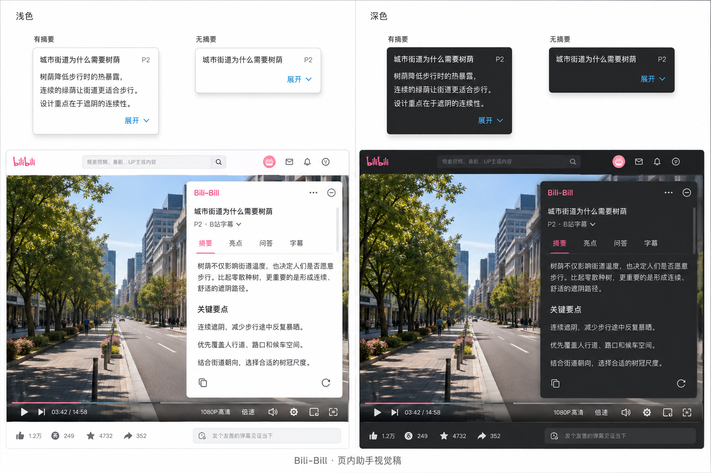
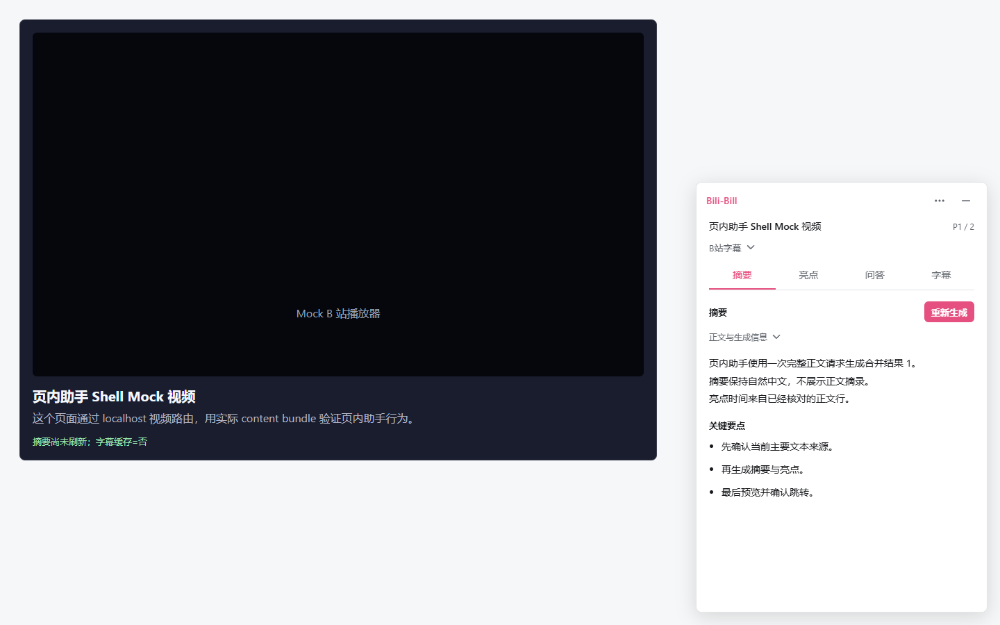
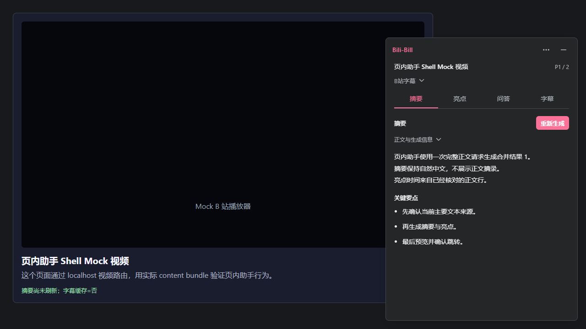
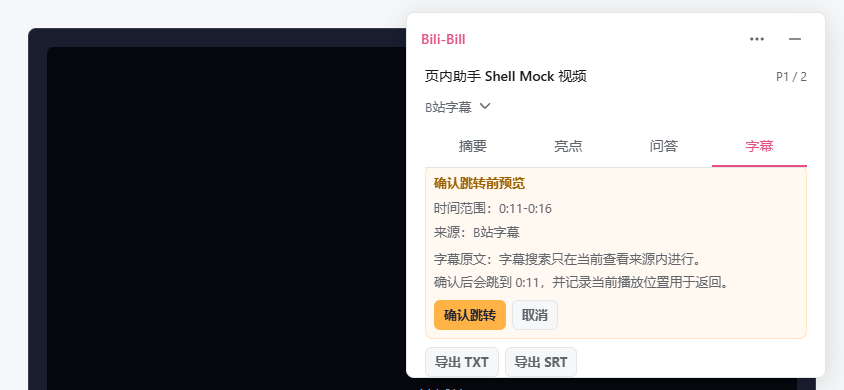
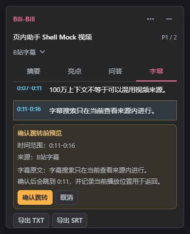

# 视频页助手 UI 实现与检查

日期：2026-09-06。关联 [UX-014 #272](https://github.com/LittleNuB/BiliBili-DataViz-Plugin/issues/272)、[范围草案 #273](https://github.com/LittleNuB/BiliBili-DataViz-Plugin/pull/273)。本目录是独立 Draft 实现的验证记录，不是发布验收。

## 最新确认的设计

用户在范围草案之后明确调整了收起态，并认可视觉稿、授权继续实现。因此，本次不采用 #272 / #273 最初的单行按钮提案。#273 已按以下确认更新并审查合并；用户最新授权允许主 Agent 自主处理常规开发、验证与已审查 PR 流转。范围、门槛、敏感数据及发布等关键决策仍须单独确认。#274 尚未完成全部验收。

- 收起：短视频标题、分 P、展开入口；存在当前有效摘要时固定展示最多三行，不跟随上次页签变化。无摘要时不展示占位、任务进度或生成按钮。
- 展开：覆盖页面的浮层，紧凑标题与分 P，主要文本来源短名称，摘要 / 亮点 / 问答 / 字幕四页签。无推挤页面的侧栏。
- 来源详情默认收起，重新检测字幕、明确选择仍可达。同一视频分 P 内检测或选择来源不收起已打开的详情；切换视频分 P 后重置。正文规模与费用按需查看。
- 移除重复识别标签、内层卡片和常驻教程；来源阻断、授权问题、进行中与取消、失败提示保留。问答提交仍明确提醒会发送当前分 P 完整正文。
- 白色 / 中性深灰表面，克制的粉色与蓝色强调，跟随宿主页明暗，没有独立主题开关。局部使用四个 Lucide 图标，许可随构建分发，无新增 npm 包。



以上是生成式概念图，不是产品截图。下面是实际生产 content bundle 注入仓库合成 fixture 的截图，没有真实用户内容或登录态。

## 实际效果

| 状态 | 尺寸或结果 |
| --- | --- |
| 无摘要小窗 | 300 × 78.39 px |
| 有摘要小窗（本次长摘要样例） | 300 × 158.78 px，正文 14px、最多三行 |
| 1440 × 900 / 1280 × 720 展开 | 420 × 620 px |
| 390 × 844 展开 | 366 × 620 px |
| 页签距顶部 | 114.39 px |
| 溢出与背景 | 三个视口均在屏内、无助手横向溢出；表面不透明、有边框阴影 |




[三行摘要小窗](390-light-compact.png) · [无摘要小窗](390-light-empty.png) · [问答](390-light-qa.png) · [字幕](390-light-subtitles.png)

## 验证与复现

初版布局回执：[report.json](report.json)。此报告只绑定初版被测 content bundle，不是 B1 / LG-0 性能收据。初版 bundle 为 131,403 bytes，SHA-256 `2b358ae0e09120e71c941a22bcd19b00c804fb5168a6e3b20872653d761f905f`。后续短高视口修复及当前 bundle 见下一节，旧截图和回执原样保留。

```powershell
npm run typecheck
npm run build
node --test tests/current-video-assistant-presentation.test.ts tests/current-video-primary-text-authorization.test.ts tests/current-video-primary-text-selection-store.test.ts tests/current-video-summary-highlights.test.ts tests/current-video-qa-sessions.test.ts tests/current-video-timestamp-jump.test.ts
# 指向本机已安装的 Playwright 和 Chrome，不使用用户浏览器 profile。
$env:UX014_PLAYWRIGHT_MODULE = '<absolute-path-to-playwright>/index.mjs'
$env:UX014_CHROME_EXECUTABLE = '<absolute-path-to-chrome>'
node tests/current-video-assistant-ux.mock-qa.mjs
# Python 环境需已有 playwright 包；同样使用全新临时浏览器上下文。
python tests/current-video-primary-text.mock-qa.py
git diff --check
```

- 相关 Node 单测：76/76。类型检查、构建及发布目录/500,000-byte 单 chunk 检查通过。
- 新 UI QA：三个视口通过，检查默认折叠、缓存三行摘要、来源名称、主题切换、草稿与页签保留、焦点、重新检测入口、旧分 P 摘要清理、无隐式 AI。
- 既有页内助手实际 bundle 回归：摘要/亮点、授权关闭、来源读写失败、分 P 与异步竞态、取消、会话、字幕查看/搜索/导出、预览/确认/返回等流程通过。测试选择器按新入口更新，未删除授权、请求参数或跳转断言。
- 调试中修复过外壳背景丢失和重新检测后来源详情自动收起；均有新增断言。旧测试中被折叠的说明改为通过入口查看或检查正文里的可见阻断提示。
- 5.6 Terra / xhigh 初版一轮只读静态复核未发现可证明的 P0/P1/P2 回归；不代替真实站点或发布验收。本次小范围修复未重复派发中立复核。

## 短高视口修复

新增 844 × 390 横屏和 390 × 480 短高窄屏实测。初版在横屏字幕页打开末条字幕的跳转预览后，确认按钮会落在正文的 `overflow: hidden` 区域内；程序调用 `scrollIntoViewIfNeeded` 可以露出它，但普通滚动不可达。因此，仅有屏内布局或自动点击通过不足以排除该问题。

修复仅将字幕页正文恢复为可滚动，保留字幕列表自身的滚动及浮层高度，不改变跳转协议或正文内容。测试在自动滚动之前检查不可滚动祖先的裁剪，再检查屏内位置与实际点击命中。

- [五视口回归回执](viewport-regression-report.json)：1440 × 900、1280 × 720、390 × 844、844 × 390、390 × 480 全部通过。
- 当时 bundle：131,401 bytes，SHA-256 `75c8a1ceb704e004dff59104d8cb2aed9f0004eb0a973b7a7b14ecf55376396a`；本轮读取中状态修复的 bundle 见下一节。
- 覆盖来源重新检测、问答草稿、字幕末条、预览不跳转、明确确认后跳转、返回原位置、导出入口可达、主题切换、旧分 P 摘要清理及无隐式 AI。
- 相关单测 13/13，typecheck、build、release-dist、diff-check 通过。未重跑完整单测或存储性能矩阵；远端 CI 状态另见 PR。B1 历史 CI 解耦 #276 已合并，UI 分支已同步；原 head `ee1f7f2` 的远端 CI 三项通过，其中全量单测 621/621。这不代替后续 head 的 CI。




常规命令 `node tests/current-video-assistant-ux.mock-qa.mjs` 现在覆盖五组尺寸。如只核对短高视口，可先设置 `$env:UX014_SHORT_VIEWPORTS_ONLY = '1'`，运行后移除该环境变量以恢复完整视口集合。这里仍是合成 fixture，未补做真实 B 站兼容性验收。

## 读取中状态与宿主页核对

2026-09-07（北京时间）补查真实匿名 B 站页面时，首次问答读取尚未完成，出现两个“收起”按钮。代码中问答与字幕视图会在构造面板时启动读取，而读取函数又同步渲染 loading 状态，导致内外两次面板追加。本地延迟响应回归在旧 bundle 上稳定捕获字幕页 `2 !== 1`，确认这不是单纯测试选择器重名。

修复让面板构造期间的读取由当前构造流程显示 loading 状态，省略那一次嵌套渲染；操作触发与异步完成仍正常重绘。不改后台协议、来源授权或 AI 调用。没有用 `.first()` 或强制点击隐藏重复面板。

- [修复后五视口和延迟读取回执](pending-panel-regression-report.json)：问答/字幕读取未完成时始终一个面板，五视口通过；41 项相关单测、typecheck/build/release-dist 通过。
- 当前 content bundle：131,514 bytes，SHA-256 `5474c5cb96d04bc2e9ec67a7727def287a3858edff372cd13567e04115fa28d8`。
- 合成宿主的原生 Fullscreen API 遮挡、退出后页签/草稿保留、不跳转及 `--bg1` 明暗切换均通过。已有全屏补充测试保留，并在本轮修复 bundle 上重新核验。

[合成宿主全屏](1440-native-fullscreen.png) · [退出后恢复](1440-fullscreen-restored.png)

真实匿名 smoke 使用 Edge 152.0.4191.62 与实际 dist 扩展，全新测试目录在本 worktree 内创建且结束后清除，未读取个人浏览器目录。没有替换站点 HTML 或扩展消息响应；测试仅限制扩展 worker 与网页主世界的 fetch，阻止 AI、字幕正文和扩展非只读 fetch。该限制不覆盖任意 XHR、站点原生遥测或 content-script 隔离世界，不能视为全网络隐私审计。

- [真实页面未完成回执](real-host-ui-incomplete-report.json)：HTTP 200，扩展加载、小窗及展开可见；但后续操作超时，完整 case 未通过。页面出现真实播放器画面，不代表播放器控件、全屏、主题或登录态已通过。该会话记录 31 次字幕类 fetch 被阻止、0 次 AI fetch；没有采集字幕正文。测试限制可能影响加载状态，超时根因尚未判定。
- [后续 HTTP 412 回执](real-host-http412-report.json)：在页面阶段停止，未绕过站点访问限制或连续重试。较早无扩展匿名 Chrome/Edge 都观察到 HTTP 200，因此不能把所有失败归为站点不可访问。
- 常规 Chrome 的本次命令行加载方式未等到扩展 worker，不能作为扩展 UI 验收。Edge 的扩展加载已确认。
- 真实页面完整全屏/恢复、播放器工具栏命中、网页全屏与真实主题仍待核对；#274 保持 Draft。真实页面截图仅作本地排查，不提交页面正文、网络日志或访问限制页面截图。

复现真实 smoke（手动运行，不纳入每次 CI；遇到访问限制停止）：

```powershell
$env:UX014_PLAYWRIGHT_MODULE = '<absolute-path-to-playwright>/index.mjs'
$env:UX014_BROWSER_EXECUTABLE = '<absolute-path-to-edge>'
node tests/current-video-assistant-host.real-smoke.mjs
```

## 边界

完整通过的 UI 证据仍是 mock 页面上的真实扩展内容脚本验证；新增真实匿名 smoke 未完整通过，不覆盖站点样式更新或第三方皮肤。没有读取个人 Cookie/profile/登录态/密钥/数据库或 npm debug logs，没有采集真实字幕。

仅修改现有助手表示层及必要的缓存只读恢复时机，不增加 AI 自动生成、权限、存储迁移、后台消息协议或学习保存功能。不改 popup/dashboard、版本、release/tag、B1 产物或阈值。未重跑无关存储矩阵；V0.14.0 完成状态不因此改变。
