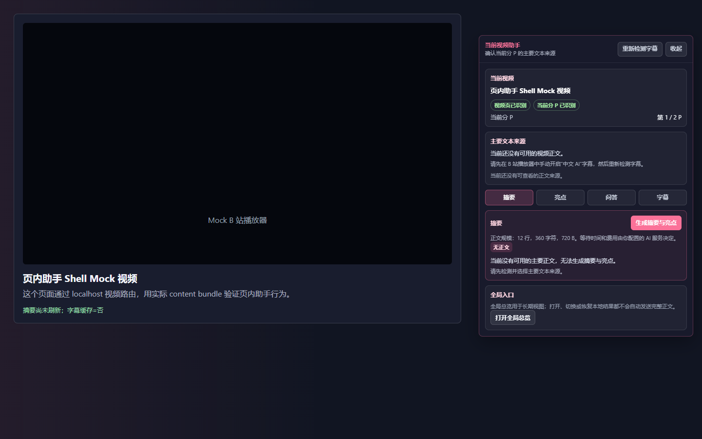
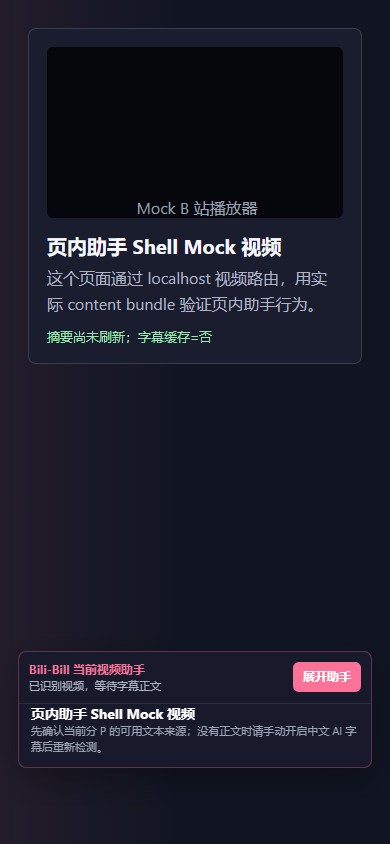

# 0.14 页内助手精简方案

关联 [UX-014 #272](https://github.com/LittleNuB/BiliBili-DataViz-Plugin/issues/272)。用户要求：视频页的小弹窗和展开完整窗口都太臃肿，应在 0.14 内优化。

状态：**范围 Draft，已按用户后续确认更新；独立实现见 [Draft #274](https://github.com/LittleNuB/BiliBili-DataViz-Plugin/pull/274)，尚未合并发布**。本方案覆盖同一页内助手的收起/展开状态，不包括浏览器工具栏 popup 或全局 dashboard。不是整站换肤，不删减现有可用能力，不借 UI 改版启动新数据功能。

## 现状依据

2026-09-06，以生产 content bundle 配合 `tests/current-video-assistant-shell.mock.html` 观察默认无正文状态，所有请求由本地合成 mock 接管；未访问登录站点或读取个人配置。生产源码与 main `0413176b8d97ab5ea6c8ba3a6e304888e71dcbd8` 一致。以下只说明该受控状态，不是全部真实页面的测量。

| 视口 | 收起容器宽/高 | 展开容器宽 | 页签距展开容器顶端 |
| --- | --- | --- | --- |
| 1440 × 900 | 300 × 121.2px | 440px | 317.2px |
| 390 × 844 | 354 × 117.2px | 354px | 347.5px |

可定位的问题：

- 收起态仍由品牌/状态、展开按钮、完整视频标题和常驻指导构成，窄屏接近整屏宽；像缩小的内容卡，而非轻量入口。
- 展开后依次叠放视频身份、识别标签、分 P、来源状态/操作说明/来源卡，之后才是四页签和任务正文。
- 无正文原因在来源区与摘要区重复，另有正文规模/费用提示、全局入口说明。相同层级的带边框块过多，正文没有获得足够视觉优先级。
- 顶层正文滚动与字幕列表的内部滚动并存，后续学习动作若继续堆卡会加重问题。

代码定位：`renderCollapsedCard`、`renderExpandedPanel`、`appendVideoIdentity`、`appendPrimaryTextSourceSwitcher`、`appendSummaryHighlightsPanel`，均位于 `src/content/player-monitor/assistant-status.ts`。现有 #214 的模块拆分方案处理代码维护性，不构成本任务的前端验收，也不要求先完成全部拆分。

## 目标布局

| 区域 | 默认呈现 | 按需呈现 |
| --- | --- | --- |
| 收起入口 | 短视频标题、分 P、可聚焦的展开动作；有当前有效摘要时固定显示最多三行，不跟随上次页签 | 长标题通过提示查看；无摘要时仅视频信息和展开入口，无占位、任务进度或生成按钮 |
| 展开标题栏 | 简洁名称、视频标题截断、分 P、收起操作 | 长标题全文、全局总览等次级导航 |
| 来源状态 | 一处短状态和来源选择触发器；阻断原因就地可见 | 来源选择列表、重新检测、更多来源细节 |
| 主导航 | 摘要、亮点、问答、字幕四个平级页签 | 不新增一级页签容纳设置或诊断 |
| 当前任务 | 正文/回答/字幕或可执行空态，及当前主要动作 | 任务相关导出、会话管理、正文规模等详情 |
| 学习动作 | LG-1/LG-2 放行后就近放在内容或选区工具栏 | 不另叠全局保存卡，也不提前显示不可用占位能力 |

默认首屏应进入阅读或操作，不要求先读说明。减少重复内容与嵌套边框，区块采用无框结构和必要分隔；不靠极小字号、紧缩点击区或隐藏必需功能实现“小”。工具操作使用有名称/提示的图标，模式使用页签，来源使用选择器，长内容保留阅读空间。

用户已确认贴近 B 站原生界面的视觉方向：白色与中性深灰表面、克制的粉色/蓝色强调，跟随宿主页明暗，不设独立主题开关。展开为覆盖页面的浮层，不推挤页面成为侧栏。来源详情默认收起；同一视频分 P 内刷新来源保留明确展开状态，切换视频或分 P 后收起。认可的生成式视觉参考与实际合成页面截图见 #274 的 `docs/qa/ux014/README.md`，两者不得混作真实站点证据。

普通说明可折叠，但无正文、未授权、来源选择未完成、当前绑定失效、生成中/失败等影响当前动作的状态必须可见。只合并重复提示，不删除来源、风险提示或用户授权。阅读历史结果时仍区分保存内容与当前核验状态。

保持一个明确的主滚动区；标题与页签不随长正文丢失。字幕列表、问答列表若需独立滚动，不再套一层竞争滚动的正文卡。窄屏按可用宽高布局，不简单横铺桌面卡片，不溢出窗口或遮住本应用自己的必要操作。真实播放器控件遮挡另做运行时核对。

## 保持的行为

- 展开、切页签、恢复本地结果不会自动发送 AI 请求；不因默认选择改变来源授权。
- 收起/展开保留当前任务、未提交输入和合法结果；BVID/分 P/来源改变时仍执行现有失效和取消规则，不为保留外观而复用旧证据。
- 问答、会话管理、字幕搜索/跟随/导出、摘要/亮点和跳转仍有可达入口；不激活当前未挂载的检索、相关收藏或知识节点。
- 跳转仍是预览、确认、返回，不能把时间按钮改成点击即跳。焦点在收起/重开后回到合理位置，页签/菜单支持键盘。
- 用户可见文案中文优先，不输出原始工程字段或错误。普通帮助与必要隐私授权不能混为同一层级。
- 此表示层任务不改消息协议、数据库 schema、来源证据合同、权限、AI 调用时机或默认设置。

## 与 0.14 的关系

UX-014 是首版必做体验支线。范围补充经审查合并后，可优化既有页内助手外壳，不等待 A2/LG-0。持久学习能力及其保存动作仍按 LG-0 → LG-1 → LG-2 的顺序放行，不能通过 UI 工作绕过数据保护。LG-5 同时验收 LG-4 和 UX-014；本任务未完成则 0.14 不能宣布完整交付。

本 PR 仅包含范围补充、前置截图和验收目标。用户已授权准备独立实现，#274 提供实际 content bundle 截图和相关回归；应先对齐并合并本范围，再审查实现。Ready、合并和发布继续单独授权，不把自主推进解释为发布授权。

## 适量验收

1. 使用既有合成 mock 覆盖桌面 1440×900、紧凑 1280×720、窄屏 390×844；截图查看收起/展开、长标题/长内容，无横向溢出或相互遮挡。不是所有视口与所有状态的笛卡尔积。
2. 一组代表状态覆盖来源可用、无正文/需选择、生成中/取消/失败与切换分 P；合并重复状态但不隐去禁用原因。
3. 检查收起/重开后的页签和草稿、四页签与次级工具可达、键盘焦点、来源选择及预览/确认/返回。复用当前页内助手、主要文本、问答会话和字幕的相关 mock QA，不改字符串断言来放过行为回退。
4. 布局改动只跑相关回归；typecheck/build/diff-check 与既有 chunk 限制保留。不因为 CSS/文案重跑 LG-0/B1；稳定版本再并入一次整版验收。
5. 实际 B站页面的遮挡、播放器兼容和登录态行为不由 mock 判通过。若需真实运行时验证，先遵守授权范围，不读取 Cookie、profile、登录文件、凭据或用户数据库。

这是一份体验任务，不添加新性能阈值、容量门槛或反复全矩阵的要求。旧 B1 绑定文档及报告保持原字节。

按用户最新节奏，日常小改动自主推进，不逐次委托中立复核；完整功能打通、数据保护关键变更和发布前才集中复核。只有范围改变、明显阻塞或合并/发布等超出授权的操作需要确认。
